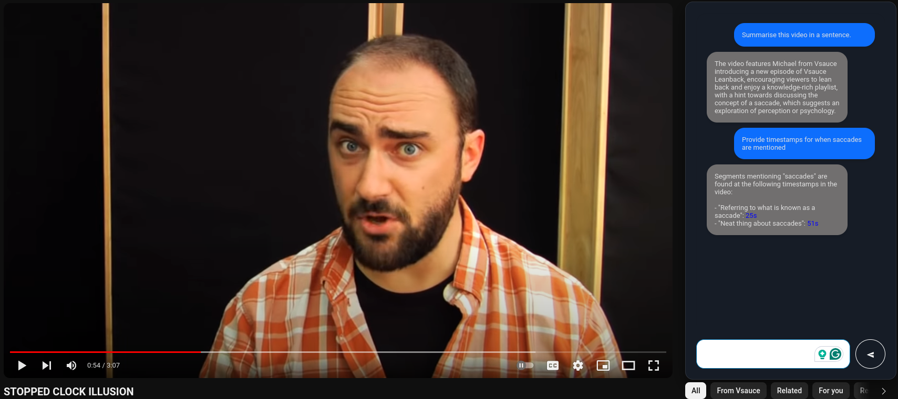

# YouTube AI Assistant Extension
This document serves as a README for the YouTube AI Assistant Extension, a Chrome extension designed to enhance the user experience on YouTube by leveraging advanced AI capabilities.

## Overview
The YouTube AI Assistant Extension is a powerful tool that integrates with YouTube to provide an interactive experience for users. By using OpenAI's Whisper model for transcription and the OpenAI Assistant API for interaction, users can ask questions about the content of the video, and obtain timestamps for specific topics within the video via an integrated chat window.

## Features
- Automatic Transcription: Obtain a text transcript of any YouTube video by processing the audio through OpenAI's Whisper model.
- Interactive Q&A: Engage with the video content by asking questions and receiving answers based on the video's transcript.
- Topic Timestamps: Quickly find parts of the video related to a particular topic with the ability to request timestamps.
## Installation
- Download the extension package.
- Open the Chrome browser and navigate to chrome://extensions/.
- Enable "Developer mode" at the top right.
- Click on "Load unpacked" and select the extension package folder.
- The YouTube AI Assistant Extension should now be added to your browser.
## Usage
### Asking Questions
- Type your question into the provided input field.
- The OpenAI Assistant will analyze the transcript and provide an answer based on the content of the video.
### Requesting Timestamps
- To find specific parts of the video, enter a topic into the input field.
- The extension will return timestamps where the topic is mentioned or discussed within the video.

## Dependencies
- OpenAI's Whisper Model
- OpenAI Assistant API
- Chrome Web Browser
- Flask (for the backend service)
- Backend Setup
- The backend is built using Flask. To set it up:

Ensure Python is installed on your system.
Install Flask by running pip install Flask.
Run the backend service by executing python app.py within the backend directory.
Limitations
The accuracy of the transcription and the Q&A responses is dependent on the quality of the video's audio.
Timestamp functionality is based on the presence of keywords and may not always reflect the full context of the video.
